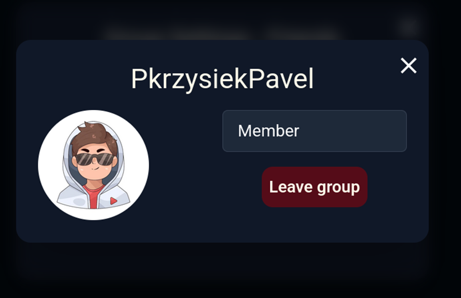
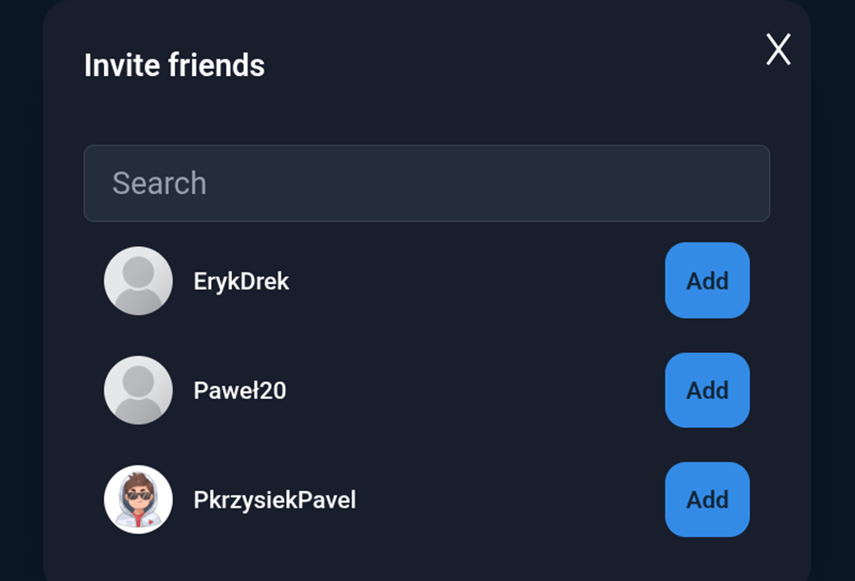
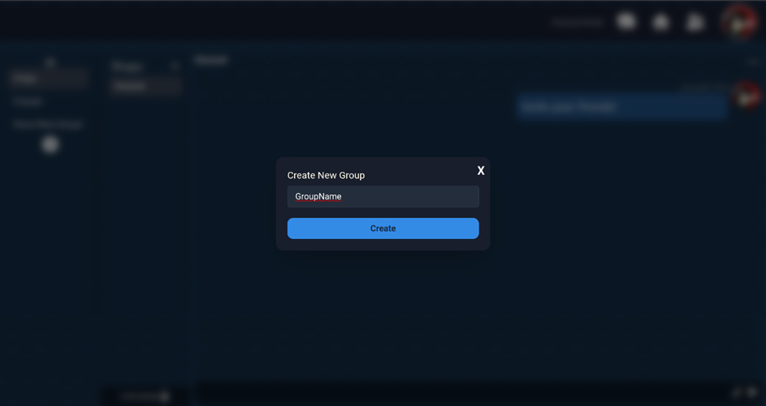
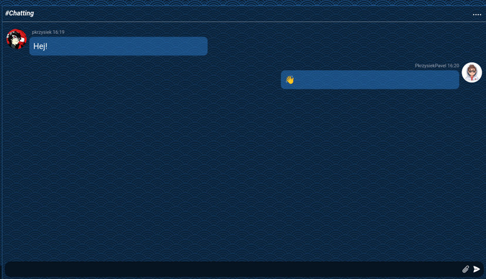
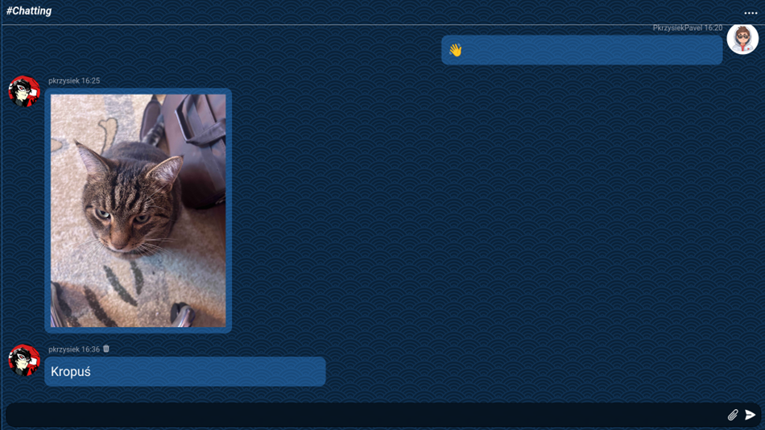

# 📬 Message-app

##  Overview

**Message-app** is a well-crafted instant-messaging application, combining a robust C# backend with a modern frontend based on TypeScript, HTML, CSS, and SCSS.  
The project focuses on security, clear code structure, and an intuitive user experience.

---

##  Key Features

- **Reliable and fast C# backend**  
  The backend is built with performance and scalability in mind, using industry-standard practices.

- **Modern frontend (TypeScript, HTML, CSS, SCSS)**  
  The user interface is responsive, clear, and user-friendly. TypeScript ensures type safety and easier long-term maintenance.

- **Security and privacy**  
  The app follows best practices to ensure user data and conversations are protected.

- **Easy to extend and maintain**  
  The architecture makes it simple to introduce new features and integrate external systems.

---

##  User Interface Examples

Below you can see selected views from the application:

### 1. User Profile Quick View  
  
_Viewing a user's profile card, role, and leaving the group._

### 2. Friend Invitation Dialog  
  
_Easily search and invite friends to your groups._

### 3. Create Group Modal  
  
_Creating new group is simple and quick._

### 4. Chat Window  
  
_Elegant chat interface for smooth communication._

### 5. Sending Images in Chat  
  
_Share images directly in the chat! A message with a picture attached appears seamlessly alongside text messages for a richer conversation experience._

---

##  Code Structure

- `Backend/` – C#: server logic, API, database handling
- `Frontend/` – TypeScript, HTML, CSS/SCSS: user interface

---

##  Why Choose Message-app?

- Uses proven technologies: **46.6% C#** (backend), **34.5% TypeScript** (frontend)
- Excellent code readability and modular structure
- High quality – built with care and attention to detail
- The architecture is ready for easy extension and long-term support

---

##  Contact

Have questions or want to contribute?  
Open an Issue or contact directly via GitHub!
